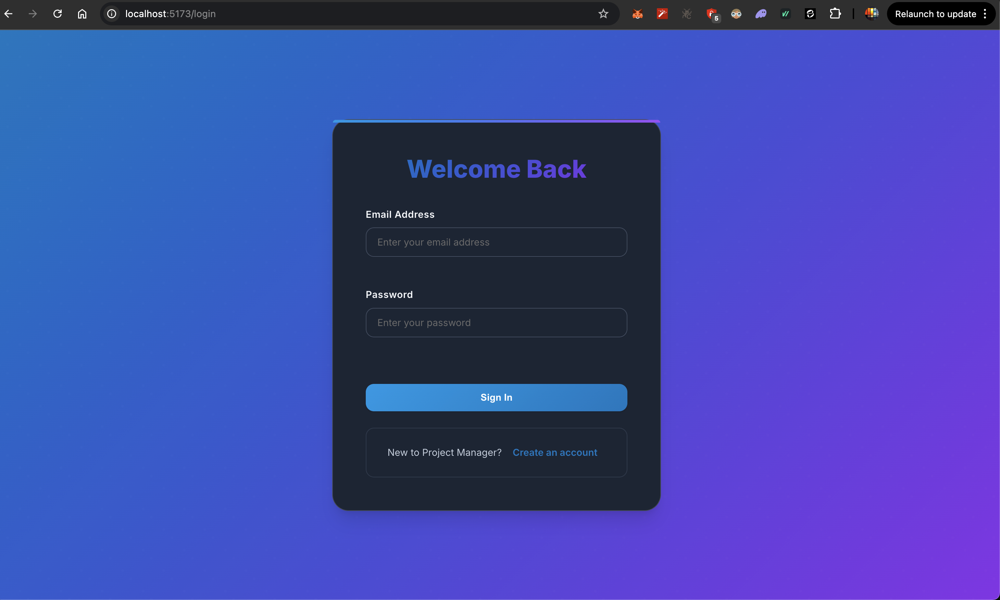
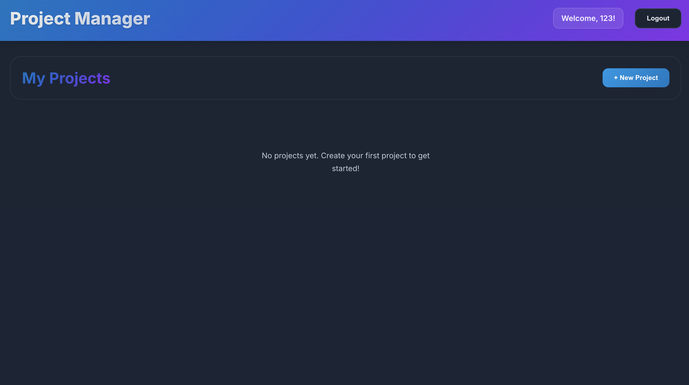
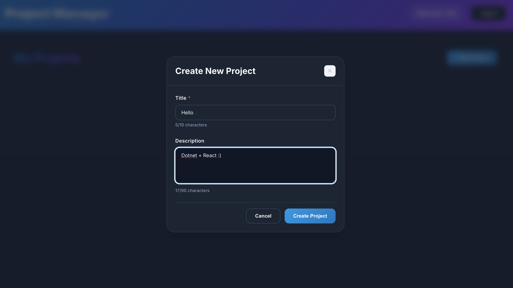
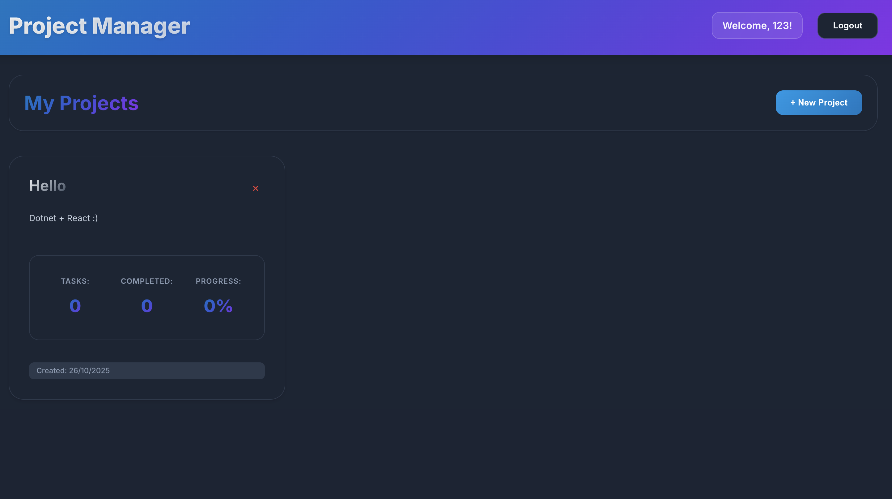
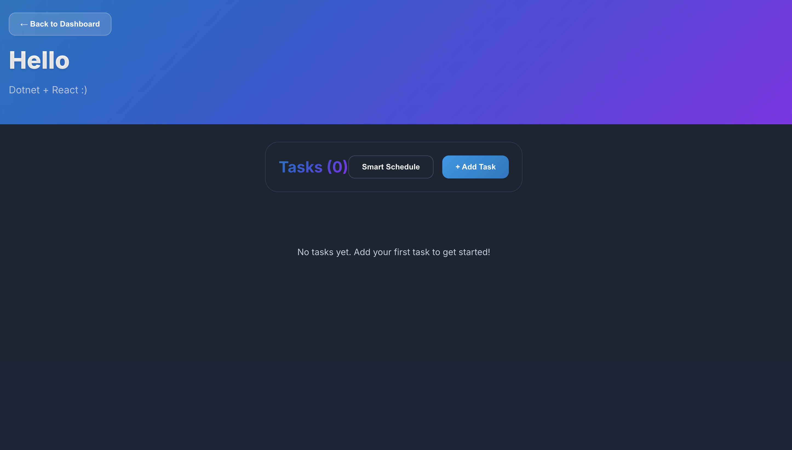
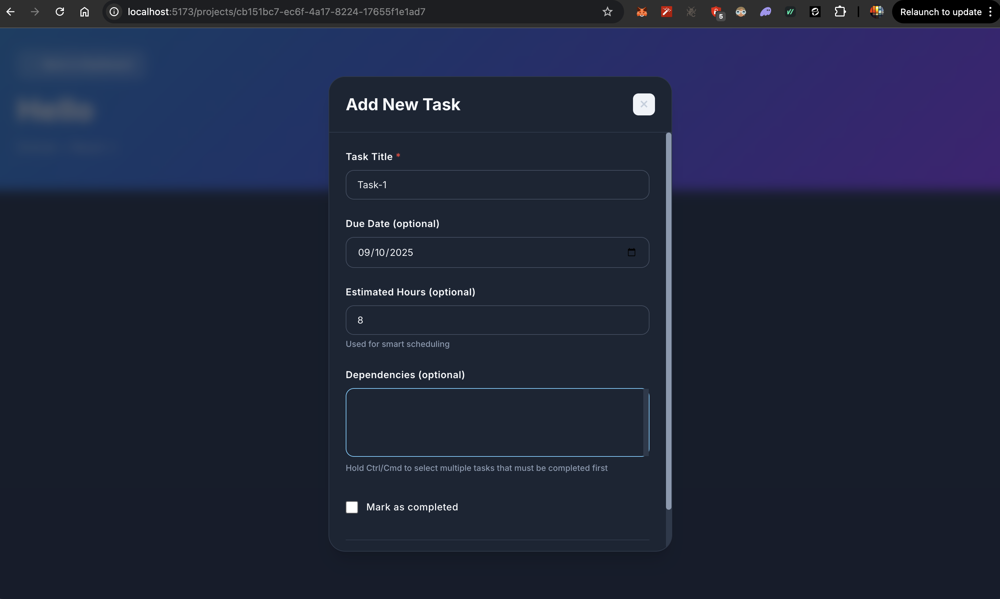
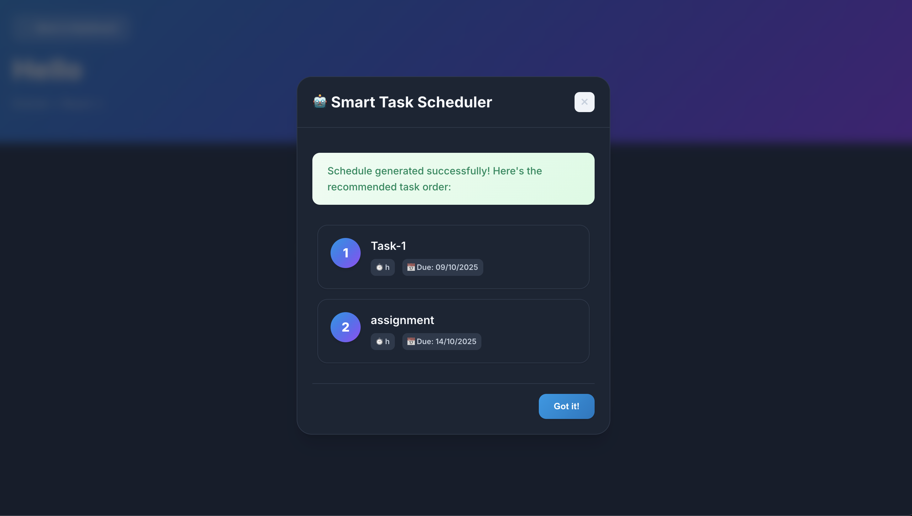

## Appsian Assignment 

Repository for the Web Development Assignment by Appsian . 


## Instructions 

To run this on your local machine 
```
git clone https://github.com/Neurophile-pro/Appsian-Coding-Assignment
cd Appsian-Coding-Assignment/react-frontend
npm i 
npm run dev 
``` 

on a new terminal window 

```
cd Appsian-Coding-Assignment/backend
dotnet restore
dotnet run
```


## UserFlow 

</img>
</img>
</img>
</img>
</img>
</img>
</img>


Repo Owner : Lakshay Mehla 
Email id : lakshay_m@mfs.iitr.ac.in
